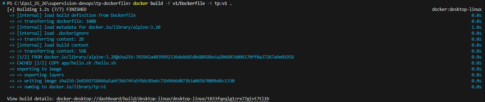
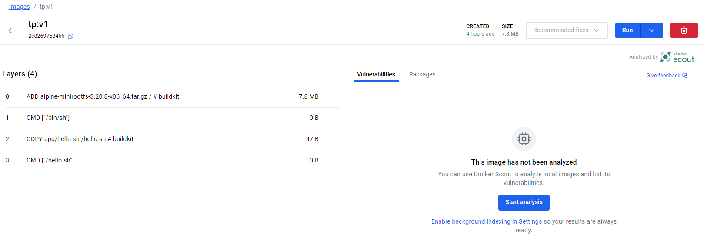
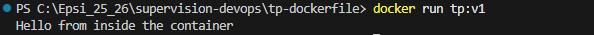
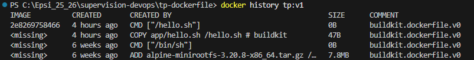

le [sujet](./public/Jouer%20ce%20module%20-%20Containerisation.pdf), pour une introduction à Docker.
--

# Partie 1 — Première image simple : hello-world personnalisé

1. Construire :
```cmd
docker build -f v1/Dockerfile -t tp:v1 .
```
Lorsque le Dockerfile n’est pas à la racine du projet, il faut préciser son chemin avec **"-f"** et définir la racine comme contexte de build.
Le **"."** represente le contexte (dossier courrant).



**"tp:v1"** c'est ne nom de l'image


2. Exécuter :
```cmd
docker run tp:v1
```


3. Afficher l'historique :
```cmd
docker history tp:v1
```
Cela l'affiche l'historique de la construction de mon image. Et l'on peut voir chaque couche (layer). ici on a 4 layers. Avec celle du "L’instruction **FROM alpine:3.20**" qui contient tout le système de fichiers de base d’Alpine Linux.


--
