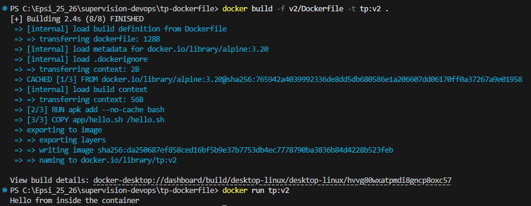
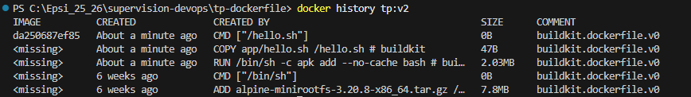
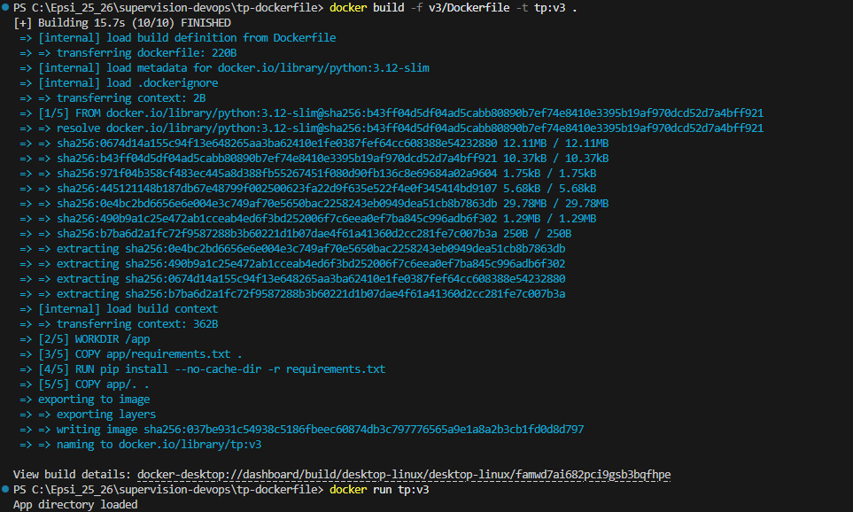
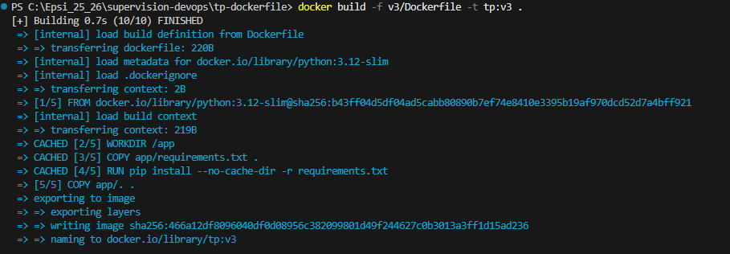
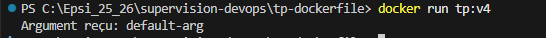
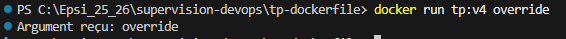

le [sujet](./public/Jouer%20ce%20module%20-%20Containerisation.pdf), pour une introduction à Docker.
--

# Partie 1 — Première image simple : hello-world personnalisé

1. Construire :
```cmd
docker build -f v1/Dockerfile -t tp:v1 .
```
Lorsque le Dockerfile n’est pas à la racine du projet, il faut préciser son chemin avec **"-f"** et définir la racine comme contexte de build.
Le **"."** represente le contexte (dossier courrant).


**"tp:v1"** c'est ne nom de l'image


2. Exécuter :
```cmd
docker run tp:v1
```


3. Afficher l'historique :
```cmd
docker history tp:v1
```
Cela l'affiche l'historique de la construction de mon image. Et l'on peut voir chaque couche (layer). ici on a 4 layers. Avec celle du "L’instruction **FROM alpine:3.20**" qui contient tout le système de fichiers de base d’Alpine Linux.


--

# Partie 2 — Ajouter un RUN et observer les layers

1. Construire et éxecuter :
```cmd
docker build -f v2/Dockerfile -t tp:v2 .
docker run tp:v2
```



2. Analyse de l'historique

Un layer est apparu celui du **"RUN apk add --no-cache bash"**.
Chaque instruction Dockerfile qui modifie le système de fichiers (comme RUN, COPY, ADD) crée une layer.


--

# Partie 3 - Réorganisation pour optimiser le cache

1. Construire et éxecuter :
```cmd
docker build -f v3/Dockerfile -t tp:v3 .
docker run tp:v3
```


2. Modifier un fichier et reconstruire

Seule la dernière layer **"COPY app/. ."** a été reconstruite à cause du changement de **"hello.sh"**.


--

# Partie 4 - Comprendre ENTRYPOINT et CMD

1. Construire :
```cmd
docker build -f v4/Dockerfile -t tp:v4 .
```
2. Tester sans argument :
```cmd
docker run tp:v4
```



3. Tester avec un argument :
```cmd
docker run tp:v4 override
```


```ENTRYPOINT  = ["/app/hello.sh"]``` & ```CMD = ["default-arg"]```

- docker run tp:v4 → /app/hello.sh default-arg
- docker run tp:v4 override → /app/hello.sh override

CMD est remplacé par l'argument s'il est fourni, mais ENTRYPOINT reste le même, le script est toujours exécuté.

--